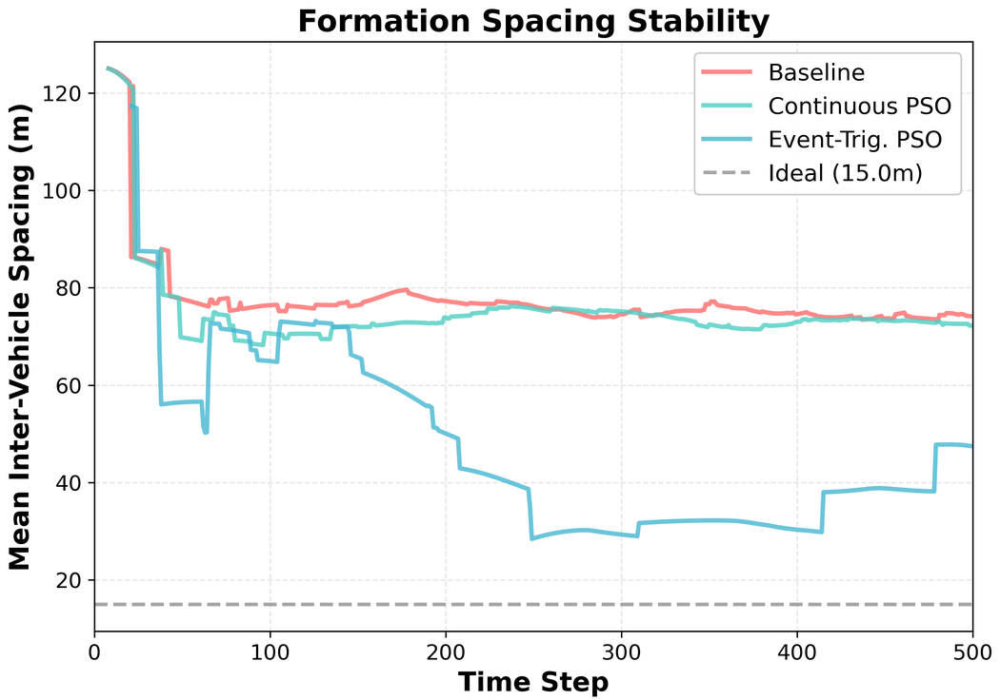
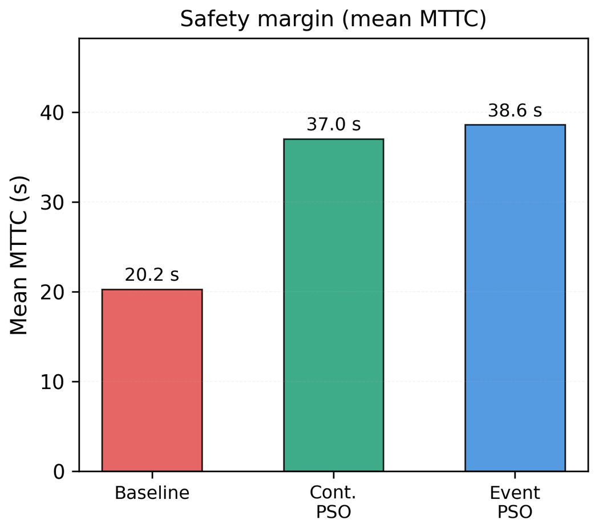
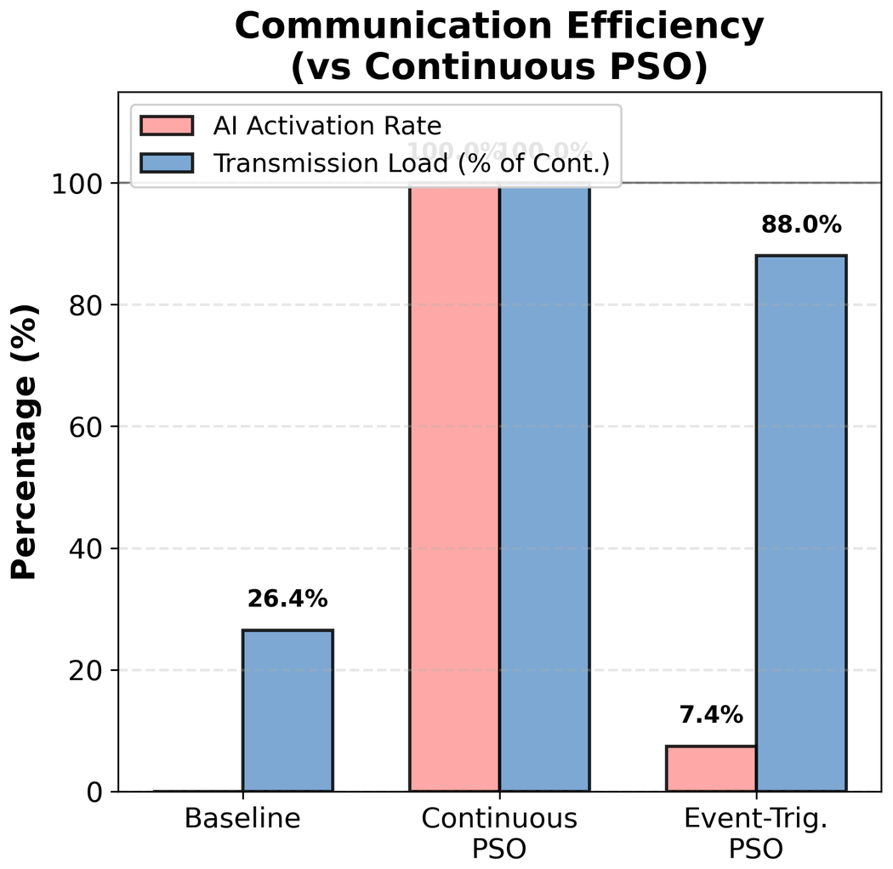
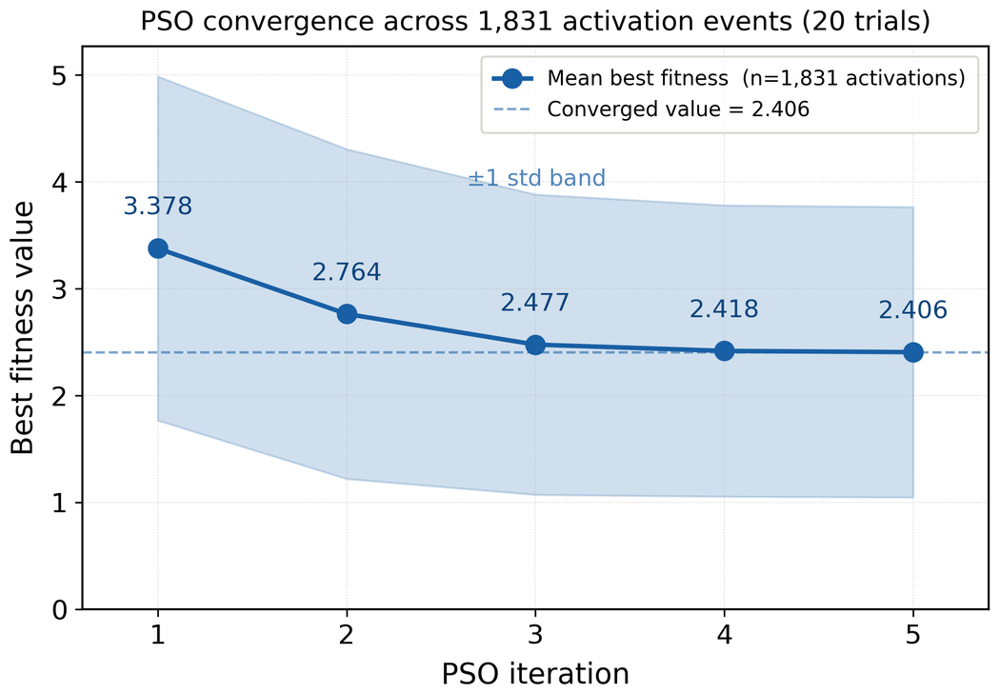
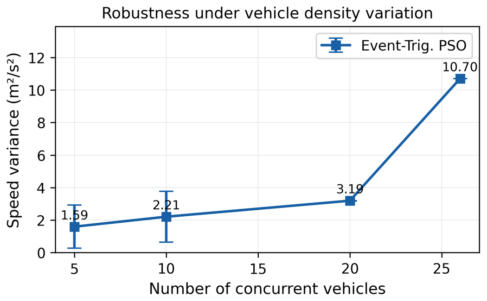

# 🚗 AI-Based Event-Triggered Decentralized Swarm Coordination for Multi-Vehicle Collision Avoidance


 

---

## 📌 Overview

This repository accompanies the IEEE-published research paper:

**AI-Based Event-Triggered Decentralized Swarm Coordination for Multi-Vehicle Collision Avoidance**

The proposed framework combines Event-Triggered Control, Particle Swarm Optimization (PSO), and Distributed Model Predictive Control (DMPC) to enable decentralized autonomous vehicle swarm coordination with significantly reduced computational overhead and communication load while maintaining collision-free operation.

### Key Outcomes

* 🏆 IEEE RAEEUCCI 2026 Best Paper Award
* 🚗 Zero collisions across 10,000 simulation timesteps
* ⚡ 92.5% reduction in active optimization
* 📉 84% reduction in computational cost
* 🛡️ 90.5% improvement in Mean Time-To-Collision (MTTC)
* 📡 Reduced communication overhead through event-triggered activation
* 📈 Scalability validated up to 26 autonomous vehicles

---

## 🧠 Research Motivation

Large-scale autonomous vehicle swarms require:

* Continuous coordination
* Collision avoidance
* Efficient communication
* Real-time trajectory planning

Traditional PSO-DMPC frameworks perform optimization at every timestep, leading to:

* High computational cost
* Increased communication load
* Limited scalability

This work introduces an event-triggered architecture where optimization is activated only when safety-critical conditions arise.

---

## 🏗️ Framework Architecture

### Event Detection

Each vehicle continuously monitors:

* Position
* Velocity
* Relative spacing
* Safety constraints

Optimization is triggered only when:

* Safety distance thresholds are violated
* Potential collision risk is detected

### Optimization Layer

#### Particle Swarm Optimization (PSO)

Used to:

* Generate warm-start solutions
* Accelerate convergence
* Reduce search complexity

#### Distributed Model Predictive Control (DMPC)

Used to:

* Generate collision-free trajectories
* Maintain formation stability
* Enforce safety constraints

### Communication Layer

* IEEE 802.11p DSRC
* Vehicle-to-Vehicle (V2V) communication
* Event-triggered transmission strategy

---

## 🔬 Research Contributions

### 1. Event-Triggered Swarm Coordination

A decentralized coordination strategy that activates optimization only when required, eliminating unnecessary computational effort.

### 2. Hybrid PSO-DMPC Framework

Integration of:

* Event-triggered control
* Particle Swarm Optimization
* Distributed Model Predictive Control

for autonomous vehicle swarm coordination.

### 3. Communication-Aware Optimization

Reduction of unnecessary V2V communication while preserving safety and formation stability.

### 4. Realistic Validation

Extensive validation performed using SUMO traffic simulation environments under multiple traffic densities and vehicle configurations.

---

## 📊 Key Experimental Results

### Formation Stability



---

### Safety Margin Improvement



---

### Communication Efficiency



---

### PSO Convergence Analysis



---

### Robustness Under Vehicle Density Variation



---

## 📈 Performance Summary

| Metric              | Baseline | Event-Triggered PSO-DMPC |
| ------------------- | -------- | ------------------------ |
| Active Optimization | 100%     | 7.5%                     |
| Computational Cost  | 100%     | 16%                      |
| MTTC                | 20.25 s  | 38.57 s                  |
| MTTC Improvement    | —        | +90.5%                   |
| Collision Events    | Present  | 0                        |
| Speed Variance      | 17.58    | 3.19                     |

---

## 📂 Repository Structure

```text
Event-Triggered-Decentralized-Swarm-Coordination/

├── figures/
│   ├── formation_spacing_stability.png
│   ├── formation_consistency.png
│   ├── deviation_from_ideal_spacing.png
│   ├── mttc_distribution.png
│   ├── safety_margin_improvement.png
│   ├── communication_efficiency.png
│   ├── pso_convergence.png
│   ├── robustness_under_vehicle_density_variation.png
│   └── statistical_significance.png
│
├── paper/
│   └── publication_information.md
│
├── LICENSE
├── CITATION.cff
└── README.md
```

---

## 📖 Publication

**IEEE RAEEUCCI 2026**

**AI-Based Event-Triggered Decentralized Swarm Coordination for Multi-Vehicle Collision Avoidance**

DOI:

https://doi.org/10.1109/RAEEUCCI67649.2026.11504821

---

## 👥 Authors

1. **Sree Dharshan G J**
2. **Surya Narayanan S**
3. **Aravindan M**
4. Akankshya Sethi

---

## 📚 Citation

```bibtex
@inproceedings{sreedharshan2026eventtriggered,
  title={AI-Based Event-Triggered Decentralized Swarm Coordination for Multi-Vehicle Collision Avoidance},
  author={Sree Dharshan, G J and Surya Narayanan, S and Aravindan, M and Akankshya, Sethi},
  booktitle={IEEE RAEEUCCI},
  year={2026}
}
```

---

## ⚠️ Repository Notice

This repository is intended for academic visibility and dissemination of published research.

The complete implementation, optimization routines, simulation source code, and experimental assets are not included due to publication and intellectual property considerations.

Only publication-related documentation, figures, and research summaries are provided.

---

## 👨‍💻 Maintainer

### Sree Dharshan G J

AI Researcher | Multi-Agent Systems | Autonomous Systems

Research Interests:

* Multi-Agent Systems
* Reinforcement Learning
* Autonomous Vehicles
* Agentic AI
* Distributed Optimization
* Event-Triggered Control

GitHub: https://github.com/SreeDharshan-GJ

---

## 📜 License

MIT License
